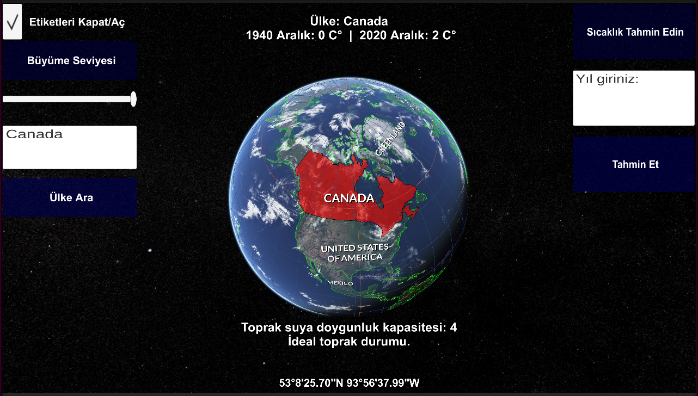

# Kodlama Marathonu 2024

As the "Greenity" Team at Kodlama Marathonu 2024, we developed a 3D simulation that predicts the next year's
temperature and ideal soil conditions. Our simulation is powered by datasets obtained from the 
Copernicus Climate Data Store (https://cds.climate.copernicus.eu/datasets), spanning data from 1940 to 2020, enabling accurate predictions for selected countries' future temperatures.

The competition featured 30 participants divided into 10 teams of 3, including us. 
Working in a collaborative team environment was an incredible experience,
and the challenge of competing against other talented teams made the event both intense and enjoyable.
This project not only deepened our technical skills but also strengthened our teamwork and problem-solving abilities.

This is the example footage of the example.

## To run this demo (Windows)
- You have to clone this repository to your local pc.
- If you have already python downloaded in your local pc:
    - Go to the webgl build file path in cmd which is called "3D World Demo" in this repository.
    - Enter `python -m http.server`
    - Now webgl build is broadcasting in your local which is `http://localhost:8000/`
    - Voila.

## IMPORTANT NOTE

This example created using Huawei Cloud Services, 
therefor some codes might not be working because some data are taken from the servers of Huawei's which is deleted after the completion of the competition.

So some codes and buttons my not work properly...
